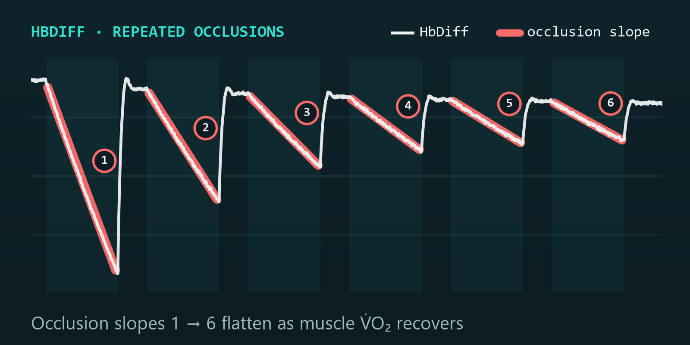
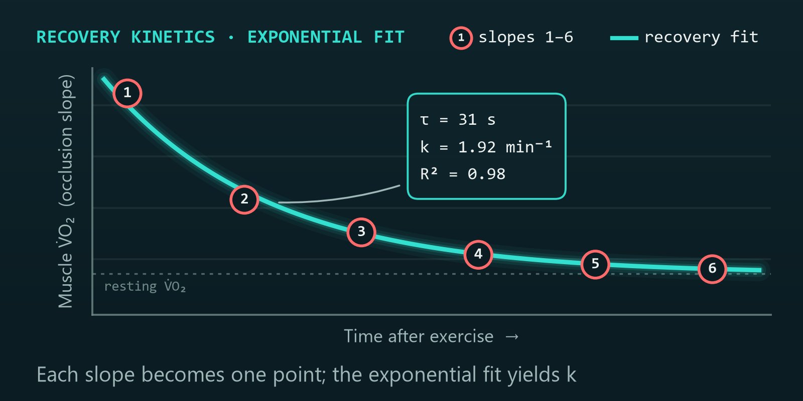
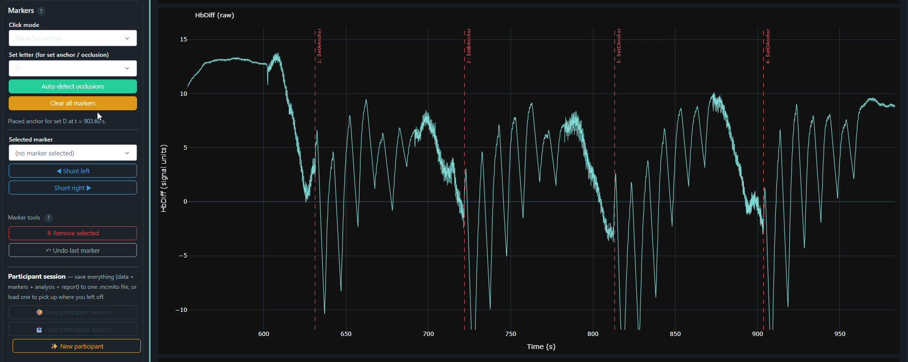
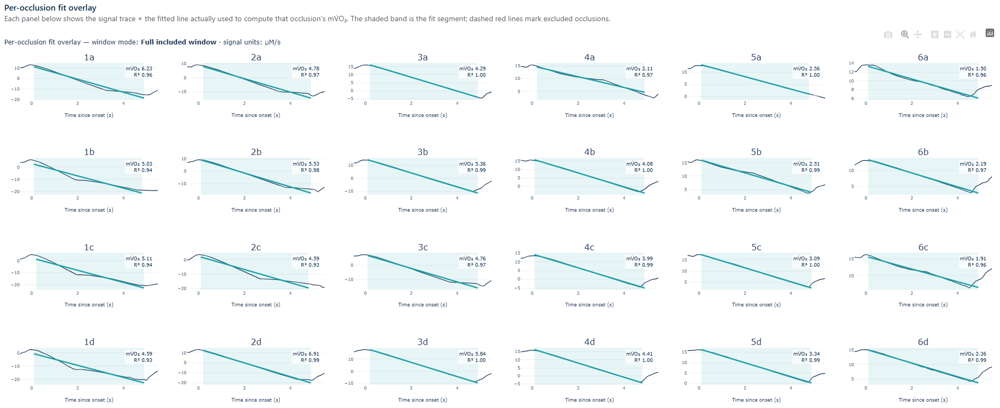
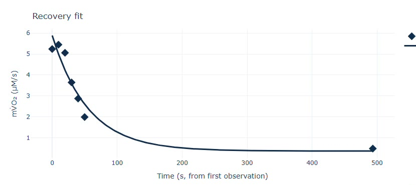
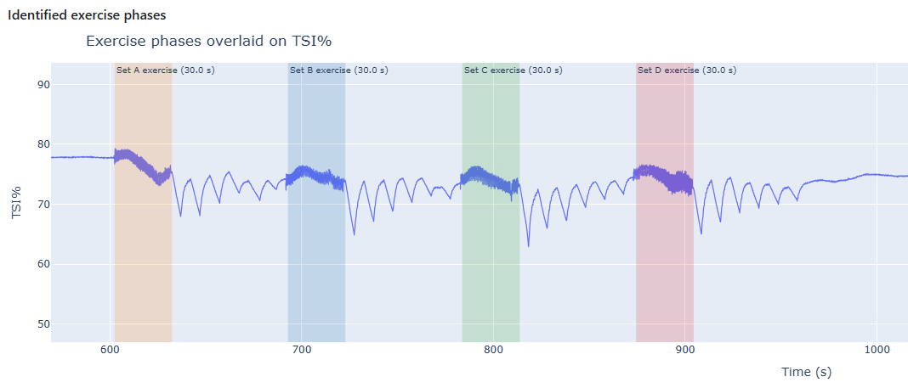

  <picture>
    <source media="(prefers-color-scheme: dark)" srcset="img/mcmito-logo-dark.png">
    
  </picture>

<h3 align="center">Near-infrared spectroscopy analysis of skeletal-muscle mitochondrial oxidative capacity</h3>

  
  
  
  

---

## Latest release

| | |
|---|---|
| **Version** | **1.2.0** (7 September 2026) |
| **Download** | [MCMITO_Setup_1.2.0.exe](https://github.com/McManus-C/McMito-releases/releases/latest) — from the *Assets* list on the release page |
| **DOI** | [10.5281/zenodo.22329660](https://doi.org/10.5281/zenodo.22329660) |
| **Website** | [www.mcmito.com](https://www.mcmito.com) |
| **Contact / licence keys** | cmcman@essex.ac.uk |

**What's new in 1.2.0**

- **Train.Red FYER import.** MCMITO now reads Train.Red session exports (`.csv`) as well as Artinis OxySoft exports; the format is detected automatically. The named header row is offered in the channel-mapping dialog, with the `unfiltered` channels (SmO2, O2HB, HHb, THb) and `Lap/Event` selected by default.
- **Sample rate inferred from timestamps.** Train.Red files carry a seconds column with irregular Bluetooth intervals and no declared rate. MCMITO estimates the native rate robustly (ignoring dropout gaps, snapped to the nominal device rate when close) and shows the native timing statistics in the mapping dialog.
- **Time-base regularisation.** Seconds-based recordings are resampled by linear interpolation onto a uniform grid at the confirmed rate, so the analysis engine sees a regular time base. On by default; can be switched off to keep native timestamps.
- **Import provenance in exports.** The Excel `Metadata` sheet gains a `Source.Import.*` block (device, sensor ID and position, time basis, native timing statistics, tHb/HbDiff identity check) and the PDF footer carries a one-line source summary. The `.mcmito` session file stores the confirmed mapping with this provenance.
- OxySoft import, all analysis outputs and existing session files are unchanged.

Full history: [CHANGELOG](#changelog) below.

> Already running **1.1.0**? Use *Settings → About → Check for updates* and the app will install 1.2.0 for you. Running **1.0.0a1**? That version predates the updater, so download and run the 1.2.0 installer once; it installs over the top and keeps your licence.

---

## What MCMITO does

MCMITO is a desktop application that turns repeated-cuff NIRS recordings into reproducible measures of skeletal-muscle mitochondrial oxidative capacity. It implements the repeated arterial-occlusion method of Ryan et al. (2012): a series of brief cuff occlusions after a short exercise stimulus, the muscle oxygen consumption (mV̇O₂) measured from the haemoglobin slope during each occlusion, and the recovery of mV̇O₂ over time fitted with a mono-exponential curve to yield a rate constant (*k*) and time constant (*τ*).

  
  

The whole pipeline runs locally on your machine. Your data never leave it.

### Capabilities

| | |
|---|---|
| **Automated occlusion detection** | Consensus detection finds every cuff occlusion in each set and places the markers for you, each with a confidence score you can accept, shunt or remove. |
| **Manual marking** | Place, move and remove set anchors and occlusion markers by hand on full-resolution traces, with instant feedback. |
| **Correction and calibration** | Ryan blood-volume correction and physiological 0–100 % calibration are built in. |
| **Per-occlusion slopes** | mV̇O₂ extracted from each occlusion, with a choice of slope window (full included window or steepest window), and automatic exclusion of low-R² and negative-slope occlusions. |
| **Recovery-curve fitting** | Mono-exponential fit of mV̇O₂ against time to *k* and *τ*, with standard errors and R² quality tiers, per set and combined. |
| **Exercise-stimulus metrics** | The exercise bout preceding each set is identified on TSI % and its key metrics extracted. |
| **Two device families** | Artinis OxySoft exports (PortaMon, PortaLite, OxyMon) and Train.Red FYER session exports, with automatic format detection and a common channel-mapping dialog. |
| **Transparent and reproducible** | Every per-occlusion slope, exclusion and fit is visible and exportable. Each export records the software and algorithm version. |
| **Publication-ready exports** | One click to a full Excel workbook and a formatted PDF report. Save and reload a complete participant session (`.mcmito`) to pick up where you left off. |

---

## How it works

**1. Import.** Drag in your NIRS recording — an Artinis OxySoft export or a Train.Red FYER session export. Map channels once; MCMITO remembers the layout. For Train.Red files the sample rate is inferred from the timestamps and the recording is regularised onto a uniform time grid.

**2. Detect and mark.** Auto-detect occlusions per set, or place and refine markers by hand.

  

**3. Correct and calibrate.** Apply blood-volume correction and physiological calibration to the signal.

**4. Fit.** Extract per-occlusion slopes and fit the recovery curve to *k* and *τ*. Every fitted line is shown alongside its mV̇O₂ and R², and exclusions are visible rather than hidden.

  

  

**5. Export.** Save the Excel workbook and PDF report, and archive the full session.

  

---

## Download and install

1. Open the [latest release](https://github.com/McManus-C/McMito-releases/releases/latest) and download **`MCMITO_Setup_<version>.exe`** from the *Assets* list. (The `manifest.txt` file alongside it is used by the app's own update check; you do not need it.)
2. Run the installer, accept the licence agreement when prompted and follow the steps. MCMITO installs per user, so no administrator rights are needed, and appears in the Start menu.
3. On first launch, choose where MCMITO should save your files (default `Documents\MCMITO`).

### Activating your licence

MCMITO requires a licence key, which is currently provided **free of charge** for research and educational use.

1. On first launch you will see an **activation screen** showing your **Machine ID**.
2. Copy the Machine ID and email it to **cmcman@essex.ac.uk**.
3. You will receive a **licence key** in return. Paste it into the activation screen and click **Activate**.

Each licence is tied to one computer and runs for a fixed period; the app warns you before it expires, and renewal is simply a new key for the same Machine ID. If you change computers, request a new key with your new Machine ID.

### System requirements

- Windows 10 or 11 (64-bit).
- No Python or other dependencies; everything is bundled.
- The app opens in its own window using Windows WebView2 (built into Windows 11 and most updated Windows 10). If WebView2 is unavailable it falls back to your default web browser.

### Updating

From version 1.1.0, use *Settings → About → Check for updates*. The app only installs releases published here that carry a valid signature and matching checksum. Your licence key and preferences are preserved.

---

## Built on the method

MCMITO implements the established repeated-cuff NIRS method for muscle mitochondrial capacity:

> Ryan TE, Erickson ML, Brizendine JT, Young HJ, McCully KK. Noninvasive evaluation of skeletal muscle mitochondrial capacity with near-infrared spectroscopy: correcting for blood volume changes. *Journal of Applied Physiology*. 2012;113(2):175–183. https://doi.org/10.1152/japplphysiol.00319.2012

The analysis pipeline has been validated against synthetic NIRS recordings with known recovery kinetics, so the pipeline is shown to recover the truth before it sees your data.

## How to cite

If you use MCMITO in your research, please cite the software together with the underlying method:

> McManus, C. (2026). *MCMITO: Near-infrared spectroscopy analysis of skeletal-muscle mitochondrial oxidative capacity* (Version 1.2.0) [Computer software]. Zenodo. https://doi.org/10.5281/zenodo.22329660

---

## Licence and intended use

MCMITO is **proprietary, licensed software** provided under an End-User Licence Agreement shown during installation. This repository holds installers and update manifests only; it does not contain source code.

MCMITO is intended for **research and educational use only and is not a medical device**. It is not for the diagnosis, prevention, monitoring, prediction, prognosis, treatment or alleviation of disease, and it has not been assessed by the MHRA or any other regulatory authority. You are responsible for independently validating any results you rely on.

## Changelog

### 1.2.0 — 7 September 2026

- New: Train.Red FYER `.csv` session import with automatic format detection; default mapping uses the `unfiltered` channels and `Lap/Event`.
- New: sample rate inferred from the timestamp column for seconds-based files (gap-robust estimate, snapped to the nominal device rate); native timing statistics shown in the mapping dialog.
- New: regularisation of irregular timestamps onto a uniform grid by linear interpolation (default on; switchable).
- New: import provenance (`Source.Import.*`) in the Excel Metadata sheet, a source line in the PDF footer, and the import mapping stored in `.mcmito` session files.
- Changed: unrecognised-file message lists supported formats; Time-column rate detection uses the gap-robust estimator.
- Unchanged: OxySoft import, analysis outputs, session-file schema (algorithm version 1).

### 1.1.0 — 28 August 2026

- New: in-app software updates (*Settings → About → Check for updates*).
- New: "as-displayed" results sheets in the Excel export (`SlopeResults_Displayed`, `OcclusionSummary_Displayed`, `FitSummary_Displayed`); the Metadata sheet records user-excluded occlusions.
- New: first-run save-location prompt (default `Documents\MCMITO`).
- Fixed: saves no longer overwrite earlier files of the same name.
- Fixed: PDF report staleness guard when exclusions change after fitting.
- Fixed: *Settings → Export preferences* now saves correctly in the installed desktop app.

### 1.0.0a1 — 25 June 2026

- First packaged release: standalone Windows application with native window, machine-bound time-limited licence activation, protected analysis core, installer and configurable output folder.
- Analysis platform: import and channel mapping, marker placement and auto-detection, blood-volume correction, physiological calibration, per-occlusion slope extraction with automatic low-R² and negative-mV̇O₂ exclusion, recovery-curve fitting (*k*, *τ*, SE, R²), exercise-stimulus metrics, Excel and PDF exports, and participant-session save/load.

---

## Contact

Chris McManus — University of Essex — cmcman@essex.ac.uk — [www.mcmito.com](https://www.mcmito.com)

© 2026 Chris McManus. All rights reserved.
